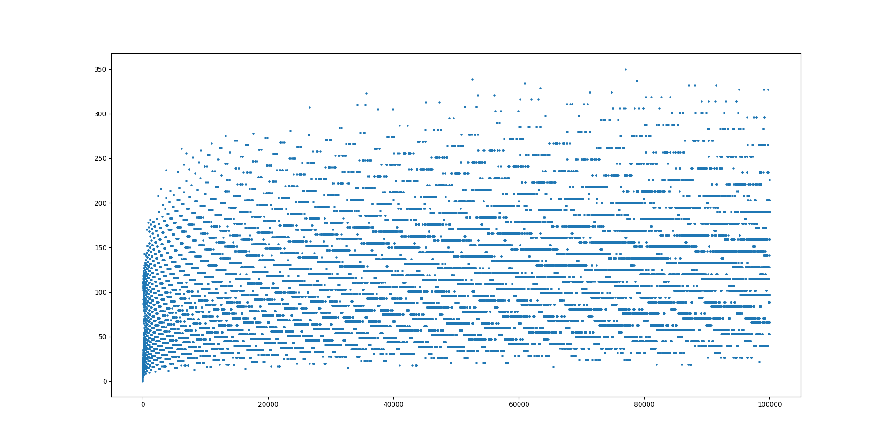

# Model Thinking

## Implementation of some commmon mathematical and statistical models into python

**1. Percolation Model**
  - Implementation of the Percolation model in a 2-dimensional grid
  - Given a grid of black and white cells, for an agent to go from one side to the other,
  - Find the minimum probability for a cell to be black such that the grid can be traversed
---
**2. Collatz Conjecture**
  - Implementation of the [Collatz Conjecture](https://en.wikipedia.org/wiki/Collatz_conjecture)
  
---
**3. TFR and Population Pyramid Modelling**
TFR Modelling
Let's say we know the following:
1. A population distribution by age (histogram)
2. The current TFR (normal distribution with mu and sigma, or maybe just an average number for this case)
3. The lifespan (normal distribution with mu and sigma, or maybe just an average number for this case)

Use these to create a chart (maybe animate over time) to show how the population distribution changes.
Then, create functionality to see the changes in this distribution if the TFR is also a time series variable (might increase or decrease)
Lifespan is also most likely to increase as time passes.

Observe:
1. Dependent vs dependee population
2. Working age bulk (demographic dividend)
3. Pension liability load: Who contributes vs who gets
4. Can sex ratio / gender imbalance be incorporated?

